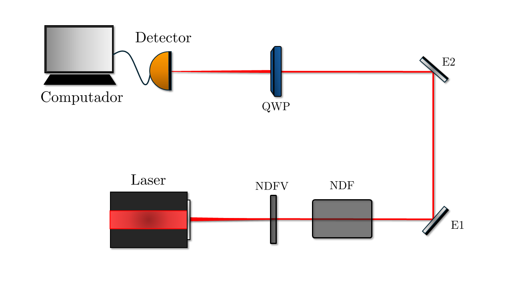

# Polarimeter

This repository contains the code to control a **polarimeter system**, which consists of a rotor, an oscilloscope, and a Moku. The system is designed to measure the intensity of light and record photon detection events in a weak light beam.

## System Description

- **Rotor (Arduino):** Controls the rotation of a polarizing filter.
- **Oscilloscope:** Captures data on light intensity.
- **Moku:** Generates the trigger signal to synchronize the system.

The system is implemented in an experimental setup aimed at measuring the number of photon detection events.



## Components

- **`rotorMountController`:** Controller for the rotor mount. It establishes a connection with the Arduino to send instructions and control rotor movement.
- **`oscilloscopeController`:** Controller for the oscilloscope. Manages the connection to the device and extracts the captured data.
- **`mokuController`:** Controller for the Moku. Responsible for configuring and controlling the trigger signal.

## Dependencies

Project dependencies can be installed by running the following command:

```bash
pip install -r requirements.txt
```

## Usage

It is posible to run the ```main.py``` file to excute the system. Or the ```real_time.py``` file to customize configurations for real-time execution.
